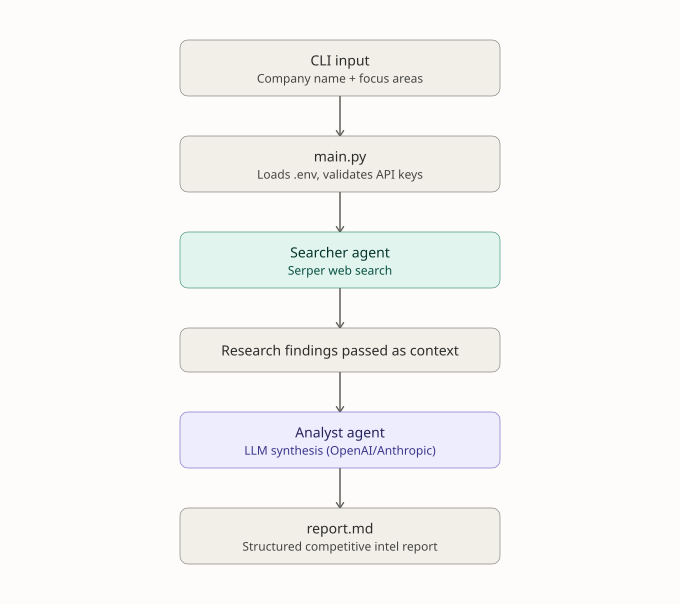
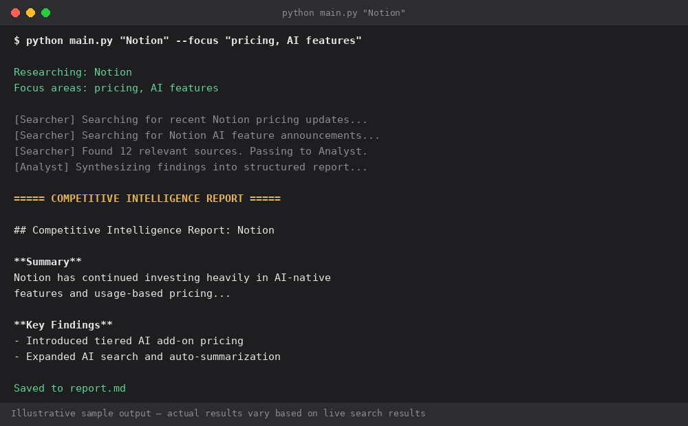

# Competitive Intelligence Crew 🤖

A multi-agent AI system built with CrewAI that researches companies using real-time web search and generates structured competitive intelligence reports.

> Automate the research. Analyze the competition. Generate actionable insights.

## How it works

1. **Market Research Searcher** — searches the web for current information about the target company: news, pricing, product launches, leadership changes
2. **Competitive Intelligence Analyst** — turns that raw research into a structured report: Summary, Key Findings, Strategic Implications, and Open Questions

This mirrors how a real competitive intelligence team works: one person gathers raw information, another synthesizes it into something a business team can act on.

## Architecture



CLI input flows into `main.py`, which validates the required API keys before anything runs. The Searcher agent then queries the Serper API and passes its findings as context to the Analyst agent, which synthesizes everything into `report.md`.

## Example output



*This is an illustrative mockup of the terminal output — not a live run — since generating real output requires your own API keys. Actual results will vary based on live search results when you run it.*

## What you need before running it

- **Python 3.10+** ([python.org/downloads](https://www.python.org/downloads/))
- **An LLM API key** — [OpenAI](https://platform.openai.com/api-keys) or [Anthropic](https://console.anthropic.com/settings/keys)
- **A Serper API key** (free tier available) — [serper.dev](https://serper.dev) — this powers the agent's web search

## Setup

1. Download/clone this repo, open a terminal in the folder.
2. Install dependencies:
   ```bash
   pip install -r requirements.txt
   ```
3. Copy `.env.example` to `.env`:
   ```bash
   cp .env.example .env
   ```
4. Fill in your API keys in `.env`.

## Usage

The company to research is fully configurable — no code editing required.

```bash
# Research the default company (set in .env, or "Notion" if unset)
python main.py

# Research a specific company
python main.py "Figma"

# Customize what the agents focus on
python main.py "Figma" --focus "AI features, enterprise pricing, recent acquisitions"

# Change where the report is saved
python main.py "Figma" --output figma_report.md
```

Run `python main.py -h` to see all options. You can also set defaults in `.env` via `COMPANY_NAME` and `FOCUS_AREAS`, so running `python main.py` with no arguments uses your own default company instead of editing source code.

You'll see both agents work in the terminal — first researching, then writing the report. The final report is also saved to a Markdown file.

## Error handling

The project fails fast with clear messages instead of a raw stack trace when something's misconfigured:

- **Missing API keys** — checked before any agent runs; tells you exactly which environment variable is missing
- **Search tool failures** — wrapped with a clear message pointing at the likely cause (bad or missing `SERPER_API_KEY`)
- **Empty company name** — rejected with a validation error rather than silently researching nothing
- **Runtime failures during the crew run** (rate limits, network issues, invalid keys) — caught and reported plainly, and the report is still saved if it was generated before the failure

## Tests

Unit tests cover the configuration and validation logic — argument parsing, environment variable checks, and error handling — without requiring API keys or making real network/LLM calls. `crewai` itself is mocked out, so the tests run fast and don't need the (heavy) real dependency installed just to verify the app's own logic.

```bash
python -m unittest discover -s tests -v
```

## Researching a different company

No code editing needed — pass the company name as a CLI argument (see Usage above), or set `COMPANY_NAME` and `FOCUS_AREAS` in your `.env` file as the default.

## Tech Stack

| Layer | Choice |
|---|---|
| Language | Python 3.10+ |
| Agent Framework | [CrewAI](https://github.com/joaomdmoura/crewAI) — multi-agent orchestration (Searcher + Analyst agents) |
| Web Search | [Serper API](https://serper.dev) — powers the Searcher agent's real-time lookups |
| LLM Provider | OpenAI or Anthropic (configurable via `.env`) |
| CLI | `argparse` — configurable company/focus/output without editing source |
| Config | `python-dotenv` for environment variable management |
| Testing | `unittest` + `unittest.mock` — no live API calls required |
| Version Control | Git / GitHub |

## Project structure

```
competitive-intelligence-crew/
├── crew.py
├── main.py
├── test_main.py
├── test_crew.py
├── architecture.svg
├── example-terminal-output.png
├── requirements.txt
├── .env.example
├── LICENSE
└── README.md
```

## Why this project

This project demonstrates how AI agents can automate a real-world business research workflow.

### Key capabilities

- Multi-agent architecture using CrewAI
- Real-time web research using the Serper API
- AI-powered analysis using OpenAI or Anthropic
- Configurable company, focus areas, and output file
- Structured competitive intelligence reports
- Environment-based API key management
- Input validation and error handling
- Unit tests with mocked external dependencies

### What I learned

Through this project, I gained practical experience in designing multi-agent workflows, integrating external APIs, handling configuration and failures, and testing AI-assisted applications without relying on live API calls.

### Future improvements

- Add additional research sources
- Introduce persistent report storage
- Add a web dashboard for easier interaction
- Support scheduled competitive intelligence monitoring
